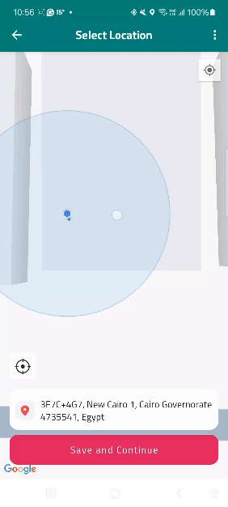

# LocationsReminder

**"A Locations Reminder app that helps users select a location on the map and get a reminder notification when they enter that location using Android Geofence."**

LocationsReminder is an app designed to help users create geofences and receive reminders for their favorite locations. It follows best practices for Android development with Kotlin. This project is part of the Udacity Android Kotlin Developer Nanodegree Program.

## Summary

This project demonstrates:

- Clean architecture with MVVM and Repository pattern.
- Offline support with Room database.
- Robust Unit and Automated Testing.
- Best practices for managing permissions, including seamless user experience.
- Integration with Firebase Auth UI for easy login.
- Google Maps integration and notification handling following best practices.

## Main Features of the Project

- **MVVM and Repository Architecture**: Implements an MVVM and Repository pattern for scalable and maintainable architecture.
- **Offline Mode**: Supports offline data access using Room for local storage.
- **Testing**: Implements Unit and Automated Testing for all project features (Logic, Room, Repository, ViewModel, Navigation, Scenario).
- **Permission Handling**: Manages user permissions with best practices to enhance the user experience.
- **Maps Integration**: Implements Google Maps with optimized map interactions and efficient location handling.
- **Orientation Support**: Adapts to portrait and landscape orientations without losing data.
- **Geofence Functionality**: Allows users to create geofences and receive reminders, ensuring clean implementation with MVVM.
- **Background Data Updates**: Uses WorkManager for one-time data updates.
- **Accessible UI**: Dynamically generated ContentDescriptions for accessibility.
- **Modern UI Design**: Utilizes single-activity architecture with multiple fragments.
- **Reactive UI**: Uses DataBindingAdapter and Kotlin Flow for a reactive user experience.
- **Firebase Authentication**: Incorporates Firebase Auth UI for a seamless login experience.
- **Dependency Injection**: Koin (v4) used for improved modularity and testability.

## Project Resources

- [Starter Project Code](https://github.com/udacity/nd940-android-kotlin-c4-starter/tree/master): Get the starter code for the project.
- [Project Rubric](https://docs.google.com/document/d/1w2jWUxAgwJBtsJmOk0h8rU7dr9Zq33k0HvhgQ-VZBYI/edit?usp=sharing): View the project rubric.
- [Android Kotlin Developer Nanodegree Program](https://www.udacity.com/course/android-kotlin-developer-nanodegree--nd940): Learn more about the full program and its related projects.

#### **Note**: Many improvements and features in this project are not included in the Project Rubric as it was initially a project for the Udacity Nanodegree Program.

## Snapshots from the App

### Phone Screens (Portrait)  

<table style="width: 100%; table-layout: fixed;">
<tr>
 <td align="center" style="width: 50%;">
   
   
<strong>Firebase Auth UI Login Screen</strong> Demonstrates integration with Firebase Auth for a seamless login experience.

 </td>
 <td align="center" style="width: 50%;">
   
   
<strong>Firebase UI Login Option Screen</strong> Enables login or account creation via Google accounts or email, demonstrating user-friendly authentication.

 </td>
</tr>
<tr>
 <td align="center" style="width: 50%;">
   
   
<strong>Add Location Reminder Screen</strong> Adds reminders with a detailed, user-friendly interface.

 </td>
 <td align="center" style="width: 50%;">
   
   
<strong>Dynamic Flow Workflow Screen</strong> Uses Kotlin Flow for real-time validation of input fields.

 </td>
</tr>
<tr>
 <td align="center" style="width: 50%;">
   
   
<strong>Google Map With Custom Style and Types Screen</strong> Implements map customization, user location display, and geolocation selection.

 </td>
 <td align="center" style="width: 50%;">
   
   
<strong>Dynamic Location Address Geocoding Screen</strong> Geocodes locations in the background using WorkManager and Google Geocoder.

 </td>
</tr>
</tr>
 <td align="center" colspan="2" style="width: 50%;">
   
   
<strong>Create Geofence Workflow Screen</strong> Shows geofence creation and notification handling following MVVM and clean architecture principles.

 </td>
</tr>                 
</table>

### Phone Screens (Landscape)  

<table style="width: 100%; table-layout: fixed;">
<tr>
 <td align="center" style="width: 100%;">
   
   
<strong>Map With Location Marker Screen in Landscape Mode</strong> Ensures seamless data saving and retrieval across orientation changes, maintaining a smooth experience.

 </td>
</tr>
<tr>
 <td align="center" style="width: 100%;">
   
   
<strong>Locations Reminder List Screen in Landscape Mode</strong> Optimized for seamless landscape viewing, maintaining consistent UI/UX quality.

 </td>
</tr>
</table>

 

## Installation Guide

This project requires creating an account on Firebase to enable Firebase Auth UI and Google Maps API Key. Follow these steps to run the app:

1. **Clone the Repository**: Clone the project repository using Git.
2. **Open in Android Studio**: Open the project in **Android Studio Ladybug (2024.2.1 Patch 2)** or later.
3. **Set up Firebase Account**: Connect the project to your Firebase console and add `google-services.json` to the app.
4. **Set up Google Maps API Key**: Connect the project to your Google Cloud Console, enable the Google Maps API key, and add it using the Secret Gradle Plugin.
5. **Add Map API Key**: Add the Map API key to the `local.properties` file or follow the [Secrets Gradle Plugin guide](https://developers.google.com/maps/documentation/places/android-sdk/secrets-gradle-plugin).
6. **Build the Project**: Use **Gradle Plugin v8.7.2** to build the project.

**Note:** Ensure you have the latest version of Android Studio and the Gradle build tool installed. Please refer to the [official guide](https://developer.android.com/studio/install) if needed.

## Main Included External Libraries

- **[Koin (v4)](https://github.com/InsertKoinIO/koin)**: Dependency injection for better modularity.
- **[Timber](https://github.com/JakeWharton/timber)**: Logging utility for easier debugging.
- **[FusedLocationProvider](https://developer.android.com/develop/sensors-and-location/location/retrieve-current)**: Fetches user's last known location.
- **[MapsSdk](https://developers.google.com/maps/documentation/android-sdk/start)**: Integrates Google Maps functionality.
- **[FirebaseUI](https://firebase.google.com/docs/auth/android/firebaseui)**: Manages login and account creation via Firebase.
- **[Glide](https://github.com/bumptech/glide)**: Efficient image loading and caching.
- **[Retrofit](https://github.com/square/retrofit)**: REST API management.
- **[Moshi](https://github.com/square/moshi)**: JSON parsing.
- **[JUnit (v4)](https://github.com/junit-team/junit4)**: Unit testing.
- **[Robolectric](https://github.com/robolectric/robolectric)**: Unit test environment.
- **[Mockito (v5)](https://github.com/mockito/mockito)**: Mocking framework for testing.
- **[Security Crypto](https://developer.android.com/jetpack/androidx/releases/security)**: Encrypts user-sensitive data.
- **[Secrets Gradle Plugin](https://developers.google.com/maps/documentation/places/android-sdk/secrets-gradle-plugin)**: Secure management of sensitive data.
- **[KSP](https://developer.android.com/build/migrate-to-ksp)**: Annotation processing.

## Contributing

Contributions are welcome! Please open an issue or submit a pull request for improvements or bug fixes.

## Contact

If you have any questions or need support, please get in touch with me through the issues section or contribute directly to enhance the project.

## License

This project is open-source and licensed under the Apache 2.0 License. The LICENSE file in this repository provides more details.
